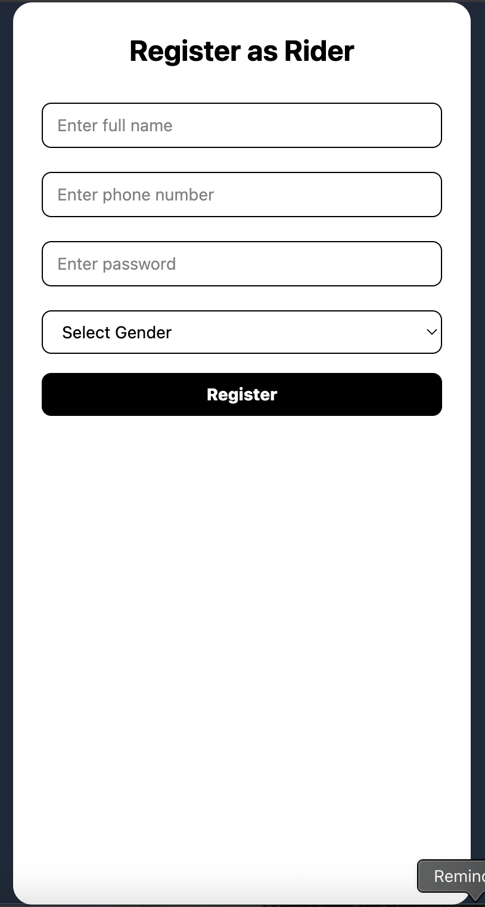
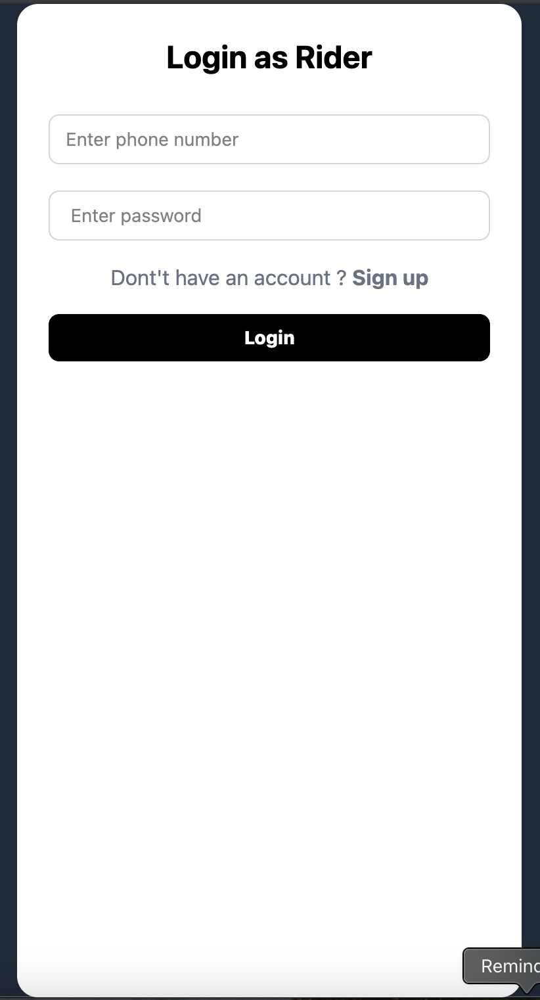
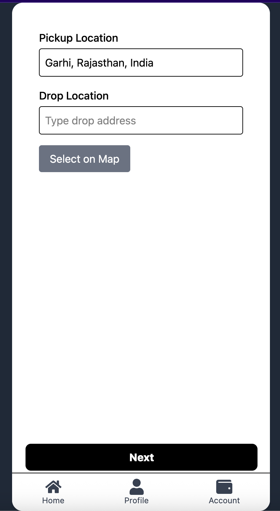

<h1>Taxi_Booking_System</h1>
Developed a real-time web application using the MERN stack that allows riders to book cabs and drivers to accept rides, featuring real-time location tracking and ride request notifications with
Socket.IO, an interactive map with Google Maps API/Leaflet to display nearby drivers and routes, authentication and role-based access using JWT and cookies, driver online/offline availability with
auto-reconnect sockets, and efficient data management with MongoDB for ride history and active sessions
  
# Rider
# Signup

# Login

# PickupAndDropLocation

# Techs

