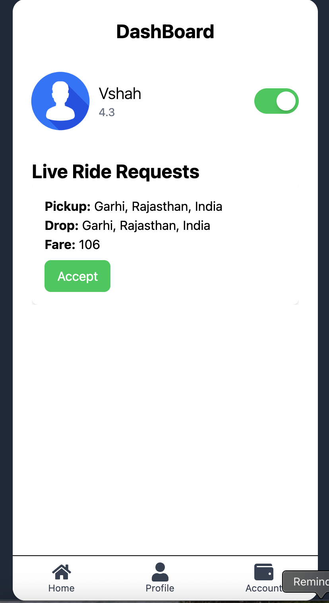

<h1>Taxi_Booking_System</h1>
The Taxi Booking System is a real-time web application developed using the MERN stack that enables riders to book cabs and drivers to accept rides seamlessly. It features real-time ride updates and notifications powered by Socket.io, along with driver online/offline availability and auto-reconnect functionality for uninterrupted service. The system integrates the Leaflet Map API to allow users to select pickup and drop-off locations, view nearby drivers, and visualize optimized routes. To ensure security, it implements JWT-based authentication and role-based access control with cookies. The platform also provides a responsive and interactive UI built with Tailwind CSS, ensuring a smooth experience across devices. On the backend, it leverages Node.js, Express.js, and MongoDB to efficiently manage bookings, ride history, and active sessions, making the system both scalable and reliable
  
# Rider
# Signup

# Login

# PickupAndDropLocation

# PickupAndDropLocation with map

# RideConfirmation

# RideWaitingConfirmation

# NavigateToPickup

# BeginToJourney

# RideCompletedStatus

# Driver
# Signup

# Login

# Dashboard 

# Dashboard with LiveRequest

# NavigateToPickup

# BeginToJourney

# RideCompletedStatus

# Techs

